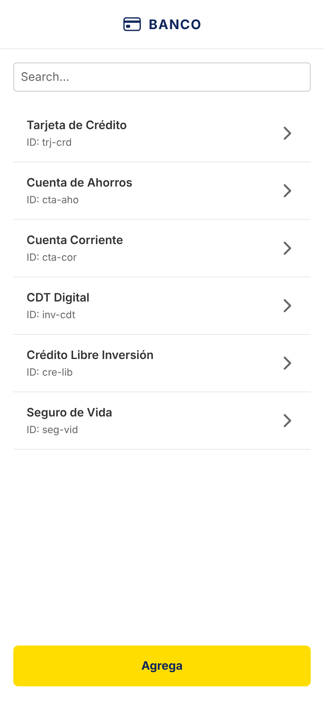
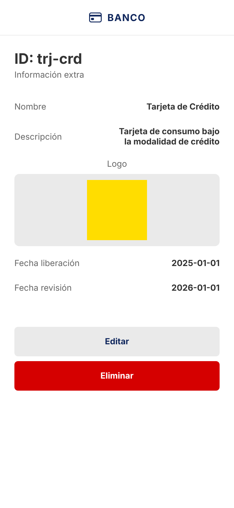
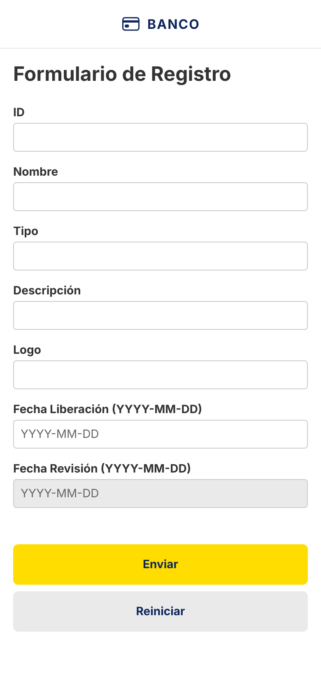

# Banco App

Aplicación móvil desarrollada en **React Native + Expo** con **TypeScript** para la gestión de productos financieros.

## Capturas

| Listado | Detalle | Formulario |
| :---: | :---: | :---: |
|  |  |  |

## Características

- Listado de productos con búsqueda y paginación simulada.
- Detalle de producto con acciones de editar y eliminar.
- Formulario de creación y edición con validaciones estrictas.
- Modal de confirmación para eliminación.
- Pruebas con Jest y React Native Testing Library.
- Skeleton loading para estados de carga.
- Arquitectura limpia y modular.

## Requisitos Previos

- Node.js v24.13.0
- Expo CLI (opcional, `npx expo` funciona)
- Emulador Android/iOS o dispositivo físico con Expo Go.
- Backend local corriendo en el puerto 3002.

## Instalación

1. Clonar el repositorio.
2. Instalar dependencias:
   ```bash
   npm install
   ```
3. Verificar que las dependencias de pruebas y navegación estén instaladas.

## Ejecución

1. Iniciar backend (en otra terminal):
   ```bash
   # Ejecutar el backend desde el repositorio repo-interview-main
   cd repo-interview-main
   npm start # (o el comando configurado en ese repo)
   ```
   *Nota: La app está configurada para conectarse a `http://localhost:3002`. Si usas Android Emulator y `localhost` no funciona, la app usa este valor por defecto. Ajustar en `src/api/instance.ts` si es necesario (`10.0.2.2` para Android).*

2. Iniciar la aplicación:
   ```bash
   npx expo start
   ```
   - Presiona `a` para Android.
   - Presiona `i` para iOS.

## Testing

Para ejecutar la suite de pruebas:

```bash
npm test
```

Esto ejecutará Jest y validará:
- Lógica de validación (`validators.test.ts`)
- Componentes y pantallas (`ProductListScreen.test.tsx`, `ProductFormScreen.test.tsx`)

## Arquitectura

- `src/api`: Comunicación con el backend.
- `src/components`: Componentes UI reutilizables (Button, Header, ProductItem, etc.).
- `src/navigation`: Configuración de rutas.
- `src/screens`: Pantallas principales.
- `src/theme`: Variables globales de estilo.
- `src/utils`: Funciones auxiliares y validaciones.
- `tests/`: Tests unitarios y de integración.

---
